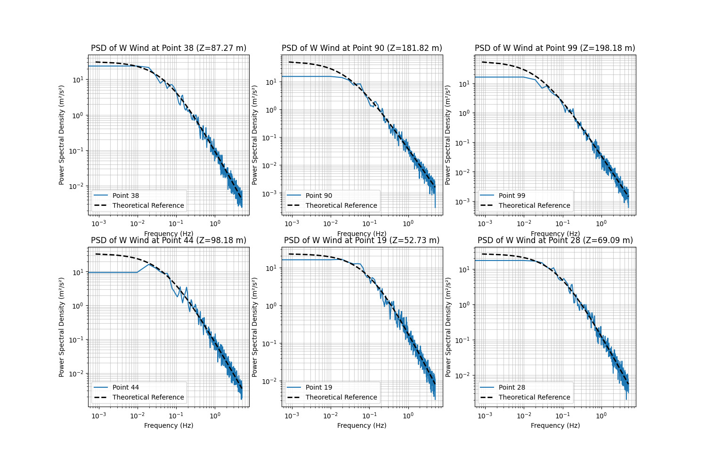
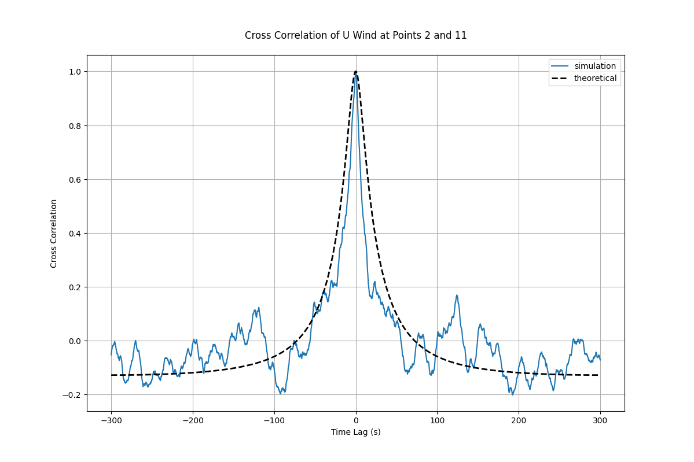

# Stochastic Wind Field Simulation


A GPU-accelerated framework for stochastic wind field simulation based on Shinozuka's harmonic synthesis method, providing significant performance improvements for wind engineering applications.

## Overview


This library implements the stochastic wind field simulation method widely used in civil engineering and wind engineering for analyzing structural responses of bridges, buildings, and other structures under wind loads. By leveraging GPU acceleration through both JAX and PyTorch backends, we achieve orders of magnitude speedup compared to traditional CPU implementations.

Key features include:
- Dual backend support (JAX and PyTorch) for maximum flexibility
- Full GPU acceleration for all computational steps
- Visualization tools for spectral analysis and correlation validation
- Configurable simulation parameters

## Representative Results






## Performance Comparison

Time comparison of wind field simulation using JAX, PyTorch, and CPU implementations. The results demonstrate the significant performance advantage of GPU-accelerated methods over traditional CPU-based approaches.


<!-- 
| Num_samples | JAX (s) | PyTorch (s) | CPU (s) |
|-------------|---------|-------------|---------|
| 100        | 1.32    | 1.56        | 7200+  | -->


## Quick Start

### Basic Usage

This library requires either JAX or PyTorch to be installed, yet it can run on CPU or GPU depending on the backend specified. The recommended backend is JAX for its superior performance, especially for vectorized operations.

```bash
python examples/basic_usage.py  --backend "jax"
```

### Example Code

```python

from stochastic_wind_simulate import get_simulator, get_visualizer

# Initialize simulator with default parameters
simulator = get_simulator(backend="jax", key=42, spectrum_type="kaimal-nd")

# Create sample points
import torch
n_points = 100
Z = 10.0  # Example height for power spectral density calculation
positions = torch.zeros((n_points, 3))
positions[:, 0] = torch.linspace(0, 100, n_points)  # x-coordinates
positions[:, 2] = Z  # height

# Run simulation
wind_speeds = positions[:, 0] * 0.2 + 25.0  # Example wind speeds based on x-coordinates
u_samples, frequencies = simulator.simulate_wind(positions, wind_speeds, component="u")

# Visualize results
visualizer = get_visualizer(backend="jax", simulator=simulator)
visualizer.plot_psd(u_samples, positions[:, -1], show_num=5, show=True, component="u")
```


## Citation

If you use this library in your research, please cite the following paper:

```bibtex
% Coming soon...
```