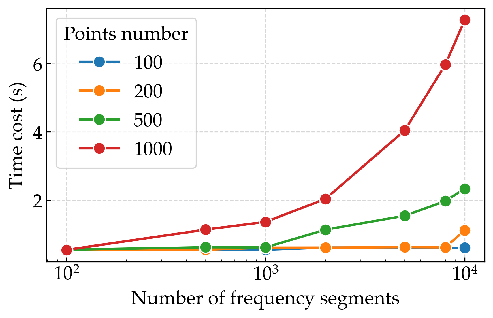
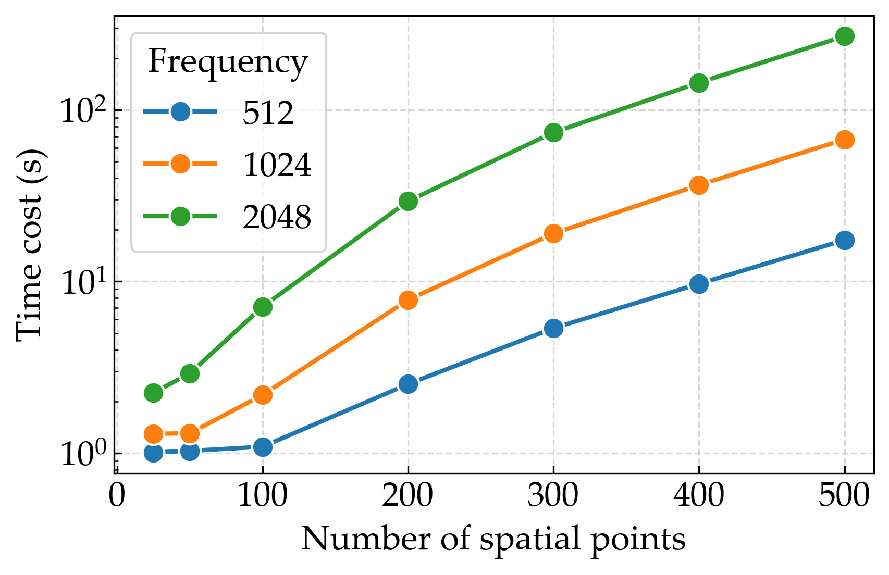

# Full Parallelized Stochastic Wind Field Simulation

Stochastic wind field simulation based on Shinozuka's harmonic synthesis method.

**Key features:**
- Full parallel computation across spatial points and frequency-time components
- Multi-backend support: JAX (recommended), PyTorch, NumPy
- Stationary and non-stationary wind field simulation without approximation such as interpolation or low-rank decomposition.

## Benchmark

### Statioanry 


### Non-stationary


## Quick Start

### Install

Install the package in editable mode:
```bash
pip install -e .
```

Install additional dependencies. `JAX` is highly recommended for best performance, but you can also use `PyTorch` or `NumPy` backends:
```bash
pip install -U jax # for CPU
pip install -U jax[cuda13] # for NVIDIA GPU with CUDA 13
```


### Stationary simulation

```bash
python scripts/basic_usage.py --n-freqs 1024 --n-points 100 --backend jax
```

### Non-stationary simulation

```bash
python scripts/simulate_nonstationary.py --n-freqs 1024 --n-points 100
```

See [scripts/](scripts/) for more examples.

## Citation

Journal paper is under review. Please cite the preprint if you find this repository useful:

```bibtex
@article{chen5707657high,
  title={A high-performance fully parallelized framework for stochastic wind field simulation: open-source implementations and engineering applications},
  author={Chen, Nanxi and Liu, Guilin and Zhang, Junrui and Ma, Rujin and Chang, Haocheng and Zhu, Yan and Qiu, Xu and Chen, Airong},
  journal={Available at SSRN 5707657}
}
```
