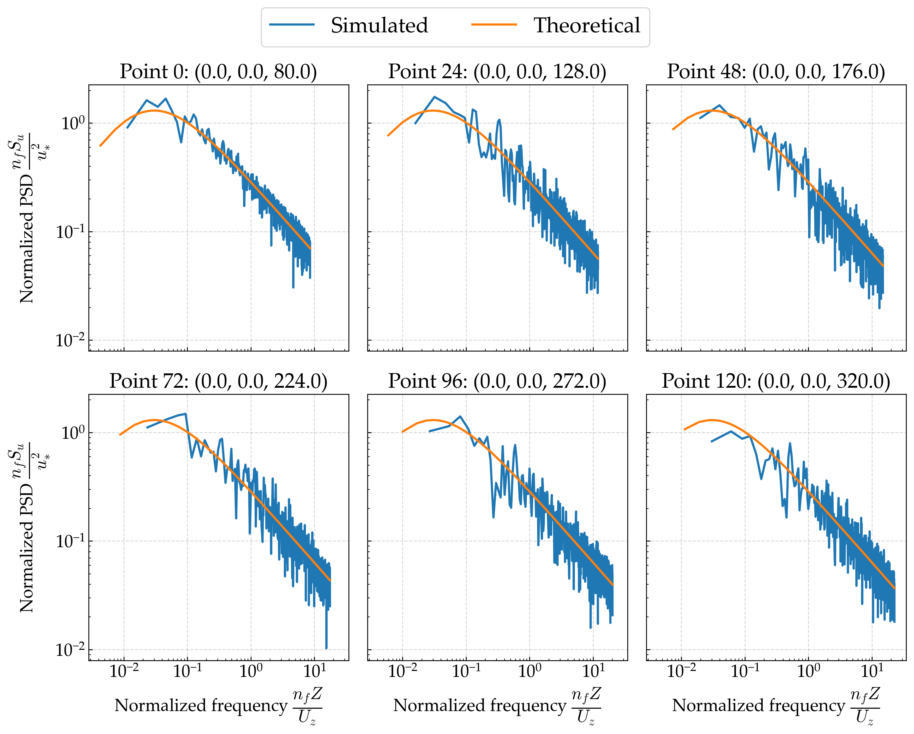
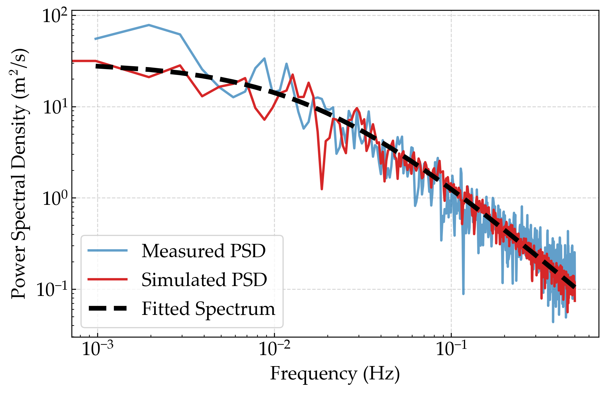
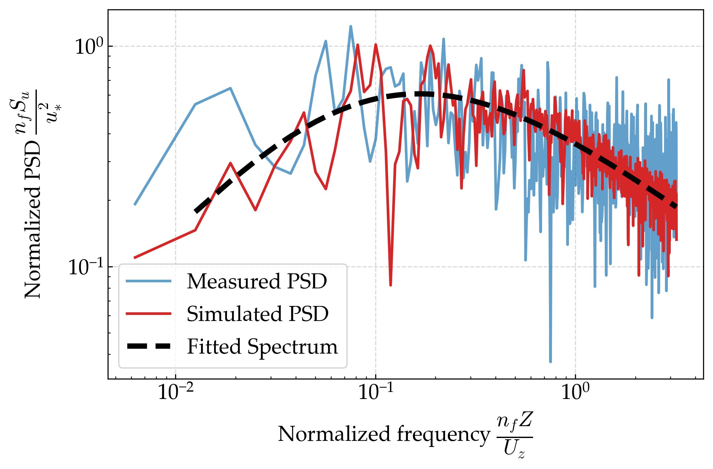
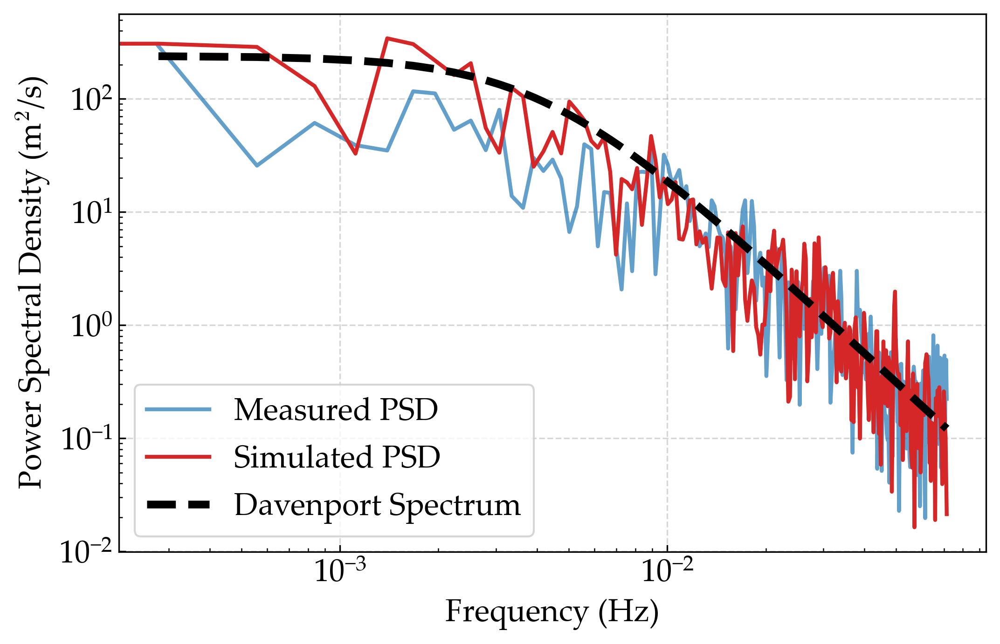

# GPU-Accelerated Stochastic Wind Field Simulation

A high-performance framework for stochastic wind field simulation based on Shinozuka's harmonic synthesis method, delivering significant computational speedups for wind engineering applications.

## Overview

Stochastic wind field simulation is extensively utilized in civil and wind engineering for analyzing the dynamic responses of bridges, buildings, and other structures under wind loading. Traditional wind field simulation methods are constrained by computational efficiency, limiting their applicability to large-scale engineering problems. This library implements the classical Shinozuka harmonic synthesis method enhanced with modern GPU parallel computing techniques to achieve efficient stochastic wind field generation.

### Key Contributions

**Efficient Parallel Computing Architecture:**
A dual-level parallelization strategy is employed, parallelizing computation across both frequency and spatial point dimensions to fully exploit GPU computational resources. Compared to traditional CPU implementations, this approach achieves orders of magnitude performance improvements in large-scale simulation scenarios.

**Multi-Backend Support:**
- **JAX Backend** (Recommended): Features XLA compilation optimization for superior performance
- **PyTorch Backend**: Excellent ecosystem compatibility with gradient computation and deep learning integration
- **NumPy Backend**: CPU computation support ensuring algorithm generality and verifiability

**Comprehensive Wind Spectrum Models:**
Built-in classical wind spectrum models (Kaimal, Teunissen, Panofsky) with support for user-defined spectrum functions to meet diverse engineering application requirements.

**Engineering Application Validation:**
The algorithm has been validated in typical engineering scenarios including long-span bridges, high-rise buildings, and offshore wind turbines, with simulation results showing excellent agreement between power spectral density and spatial correlation with theoretical values.

### Technical Features

- 🚀 **Massive-Scale Simulation Capability**: Supports simultaneous simulation of tens of thousands of spatial points and thousands of frequency components
- ⚡ **Ultimate Performance Optimization**: GPU acceleration achieves 1000+ times speedup compared to CPU implementations
- 🔧 **Modular Architecture Design**: Easily extensible wind spectrum models and visualization components
- 📊 **Comprehensive Validation Tools**: Built-in power spectral density and spatial correlation validation functions
- 🎯 **Engineering-Oriented Application**: Specially optimized parameter configurations suitable for practical engineering projects

## Validation Results

### Algorithm Validation



### Performance Comparison

Time comparison of wind field simulation using JAX, PyTorch, and NumPy implementations. The results demonstrate the significant performance advantage of GPU-accelerated methods over traditional CPU-based approaches.

<!-- 
 -->


### Application to Engineering Problems

#### Long-span Bridge
<!--  -->


#### High-rise Building
<!--  -->


#### Offshore Wind Turbine
<!--  -->


## Quick Start

### Basic Usage

This library requires either JAX, PyTorch, or NumPy to be installed, and can run on CPU or GPU depending on the backend specified. The recommended backend is JAX for its superior performance, especially for vectorized operations.

```bash
python scripts/basic_usage.py --backend "jax"    # JAX backend (recommended)
python scripts/basic_usage.py --backend "torch"  # PyTorch backend  
python scripts/basic_usage.py --backend "numpy"  # NumPy backend
```

### Example Code

```python
import numpy as np
from stochastic_wind_simulate import get_simulator, get_visualizer

# Choose backend
backend = "jax"  # or "torch" or "numpy"

# Initialize simulator with default parameters and specify wind spectrum type
simulator = get_simulator(backend=backend, key=42, spectrum_type="kaimal-nd")
# Available spectrum types: "kaimal-nd", "teunissen-nd", "panofsky-nd"

# Create sample points
n_points = 100
Z = 10.0  # Example height for power spectral density calculation
positions = np.zeros((n_points, 3))
positions[:, 0] = np.linspace(0, 100, n_points)  # x-coordinates
positions[:, 2] = Z  # height

# Convert to appropriate backend format
if backend == "jax":
    import jax.numpy as jnp
    positions = jnp.array(positions)
elif backend == "torch":
    import torch
    positions = torch.from_numpy(positions)
# For numpy backend, no conversion needed

# Run simulation
wind_speeds = positions[:, 0] * 0.2 + 25.0  # Example wind speeds based on x-coordinates
u_samples, frequencies = simulator.simulate_wind(positions, wind_speeds, component="u")

# Visualize results
visualizer = get_visualizer(backend=backend, simulator=simulator)
visualizer.plot_psd(u_samples, positions[:, -1], show_num=5, show=True, component="u")
```

### Wind Spectrum Models

The library supports multiple wind spectrum models:

- **Kaimal Spectrum** (`"kaimal-nd"`): Classical model for along-wind turbulence
- **Teunissen Spectrum** (`"teunissen-nd"`): Enhanced model for both along-wind and vertical turbulence  
- **Panofsky Spectrum** (`"panofsky-nd"`): Model for vertical wind turbulence

### Custom Wind Spectrum

You can easily implement custom wind spectrum models by extending the base spectrum classes:

```python
from stochastic_wind_simulate.jax_backend.psd import WindSpectrumNonDimensional

class CustomWindSpectrum(WindSpectrumNonDimensional):
    def calculate_power_spectrum_u(self, n, u_star, f):
        # Implement your custom along-wind spectrum
        return (u_star**2 / n) * custom_formula(f)
    
    def calculate_power_spectrum_w(self, n, u_star, f):
        # Implement your custom vertical wind spectrum  
        return (u_star**2 / n) * custom_formula_w(f)
```


## Citation

If you use this library in your research, please cite the following paper:

```bibtex
@article{chen5707657high,
  title={A high-performance fully parallelized framework for stochastic wind field simulation: open-source implementations and engineering applications},
  author={Chen, Nanxi and Liu, Guilin and Zhang, Junrui and Ma, Rujin and Chang, Haocheng and Zhu, Yan and Qiu, Xu and Chen, Airong},
  journal={Available at SSRN 5707657}
}
```
