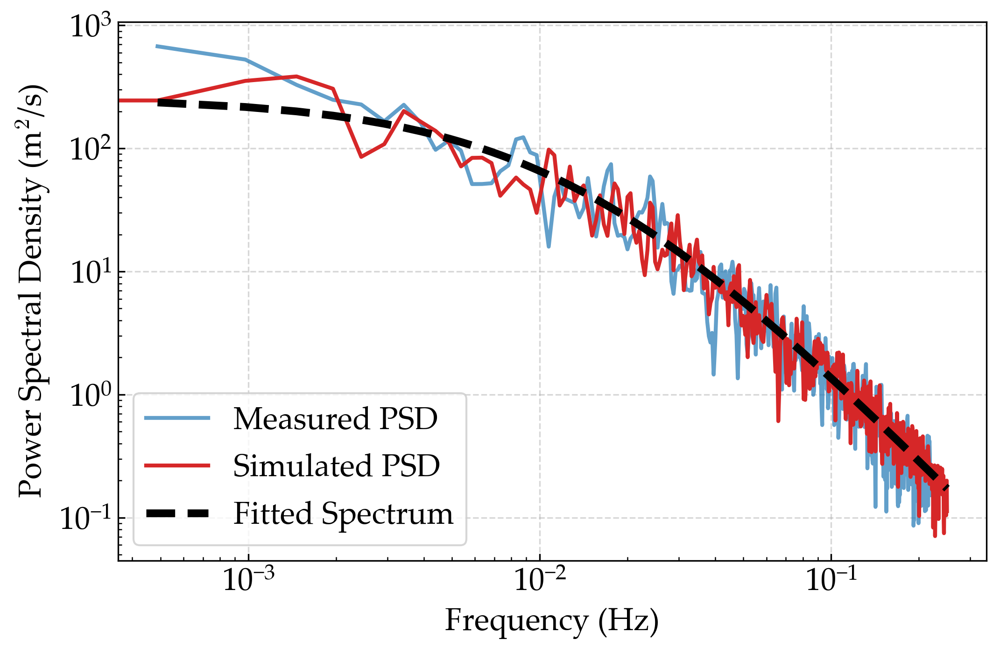

# Stochastic Wind Field Simulation


A GPU-accelerated framework for stochastic wind field simulation based on Shinozuka's harmonic synthesis method, providing significant performance improvements for wind engineering applications.

## Overview


This library implements the stochastic wind field simulation method widely used in civil engineering and wind engineering for analyzing structural responses of bridges, buildings, and other structures under wind loads. By leveraging GPU acceleration through JAX and PyTorch backends, as well as providing a NumPy backend for CPU computations, we achieve orders of magnitude speedup compared to traditional implementations.

Key features include:
- Triple backend support (JAX, PyTorch, and NumPy) for maximum flexibility
- Full GPU acceleration for JAX and PyTorch backends
- Multiple wind spectrum models (Kaimal, Teunissen, Panofsky) with convenient custom spectrum interface
- Modular spectrum architecture allowing easy implementation of custom wind spectrum models
- Visualization tools for spectral analysis and correlation validation
- Configurable simulation parameters

## Representative Results

### Benchmarks


### Performance Comparison

Time comparison of wind field simulation using JAX, PyTorch, and NumPy implementations. The results demonstrate the significant performance advantage of GPU-accelerated methods over traditional CPU-based approaches.

<!-- 
 -->


### Application to Engineering Problems

#### Long-span Bridge
<!--  -->


#### High-rise Building
<!--  -->


#### Offshore Wind Turbine
<!--  -->


## Installation

### Prerequisites

Choose one of the following backends:

**JAX (Recommended for best performance):**
```bash
pip install jax jaxlib
# For GPU support:
pip install jax[cuda12_pip] -f https://storage.googleapis.com/jax-releases/jax_cuda_releases.html
```

**PyTorch:**
```bash
pip install torch
# For GPU support, visit: https://pytorch.org/get-started/locally/
```

**NumPy (CPU only):**
```bash
pip install numpy scipy
```

### Common Dependencies

```bash
pip install matplotlib scipy
```


## Quick Start

### Basic Usage

This library requires either JAX, PyTorch, or NumPy to be installed, and can run on CPU or GPU depending on the backend specified. The recommended backend is JAX for its superior performance, especially for vectorized operations.

```bash
python examples/basic_usage.py --backend "jax"    # JAX backend (recommended)
python examples/basic_usage.py --backend "torch"  # PyTorch backend  
python examples/basic_usage.py --backend "numpy"  # NumPy backend
```

### Example Code

```python
import numpy as np
from stochastic_wind_simulate import get_simulator, get_visualizer

# Choose backend
backend = "jax"  # or "torch" or "numpy"

# Initialize simulator with default parameters and specify wind spectrum type
simulator = get_simulator(backend=backend, key=42, spectrum_type="kaimal-nd")
# Available spectrum types: "kaimal-nd", "teunissen-nd", "panofsky-nd"

# Create sample points
n_points = 100
Z = 10.0  # Example height for power spectral density calculation
positions = np.zeros((n_points, 3))
positions[:, 0] = np.linspace(0, 100, n_points)  # x-coordinates
positions[:, 2] = Z  # height

# Convert to appropriate backend format
if backend == "jax":
    import jax.numpy as jnp
    positions = jnp.array(positions)
elif backend == "torch":
    import torch
    positions = torch.from_numpy(positions)
# For numpy backend, no conversion needed

# Run simulation
wind_speeds = positions[:, 0] * 0.2 + 25.0  # Example wind speeds based on x-coordinates
u_samples, frequencies = simulator.simulate_wind(positions, wind_speeds, component="u")

# Visualize results
visualizer = get_visualizer(backend=backend, simulator=simulator)
visualizer.plot_psd(u_samples, positions[:, -1], show_num=5, show=True, component="u")
```

### Wind Spectrum Models

The library supports multiple wind spectrum models:

- **Kaimal Spectrum** (`"kaimal-nd"`): Classical model for along-wind turbulence
- **Teunissen Spectrum** (`"teunissen-nd"`): Enhanced model for both along-wind and vertical turbulence  
- **Panofsky Spectrum** (`"panofsky-nd"`): Model for vertical wind turbulence

### Custom Wind Spectrum

You can easily implement custom wind spectrum models by extending the base spectrum classes:

```python
from stochastic_wind_simulate.jax_backend.psd import WindSpectrumNonDimensional

class CustomWindSpectrum(WindSpectrumNonDimensional):
    def calculate_power_spectrum_u(self, n, u_star, f):
        # Implement your custom along-wind spectrum
        return (u_star**2 / n) * custom_formula(f)
    
    def calculate_power_spectrum_w(self, n, u_star, f):
        # Implement your custom vertical wind spectrum  
        return (u_star**2 / n) * custom_formula_w(f)
```


## Citation

If you use this library in your research, please cite the following paper:

```bibtex
% Coming soon...
```